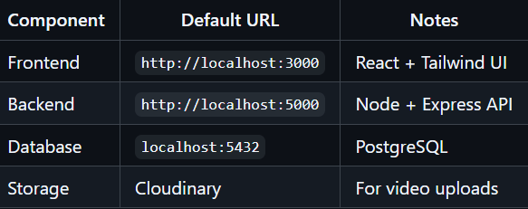

# 🌍 Scout.kz

**A modern web platform for scouting talents and opportunities.**

---

## 🚀 Overview

Scout.kz is a **full-stack scouting platform** that connects players, scouts, and coaches.  
It provides tools for **profile creation, video uploads, ratings, and talent discovery**.

The system is built with a **Node+Express backend**, **PostgreSQL database**, and a **React + Tailwind CSS frontend**.

---

## 📱 Features Overview

### 👥 User Roles & Permissions

- **Player**: Create profile, upload videos, view ratings
- **Scout/Coach**: View players, rate players, search/filter
- **Admin**: Full access _(future feature)_

### ⚡ Core Functionality

✅ JWT-based authentication  
✅ Phone number registration/login  
✅ Player profile creation/editing  
✅ Video upload to **Cloudinary**  
✅ Rating system (1–10 scale)  
✅ Advanced search and filtering  
✅ Responsive design  
✅ Real-time feedback  
✅ File upload validation

---

## 🔌 API Endpoints

**Auth**

- `POST /auth/register` – User registration
- `POST /auth/login` – User login

**Players**

- `GET/POST /players/profile` – Player profile management
- `GET /players` – List players (with filters)
- `GET /players/:id` – Get specific player

**Videos**

- `POST /videos/upload` – Upload video
- `GET /videos/my-videos` – Get user’s videos
- `GET /videos/player/:id` – Get player’s videos

**Ratings**

- `POST /ratings` – Create/update rating
- `GET /ratings/player/:id` – Get player ratings

---

## 🛡️ Security Features

- 🔑 JWT token authentication
- 🔒 Password hashing with **bcrypt**
- 📝 Input validation with **Joi**
- ⏱️ Rate limiting
- 🌍 CORS configuration
- 🛡️ SQL injection prevention
- 📂 File upload validation
- 🪖 Helmet security headers

---

## 🧪 Testing the Application

### 1. Register Users

- Go to `/register`
- Create a **player account**
- Create a **scout/coach account**

### 2. Create Player Profile

- Login as **player**
- Go to `/profile`
- Fill out profile information

### 3. Upload Videos

- Go to `/upload-video`
- Upload a video file (max **100MB**)
- Add title and description

### 4. Scout/Coach Features

- Login as **scout/coach**
- Go to `/players` to browse players
- Click on a player to view details
- Rate players using the **rating system**
- Filter players by **position, city, age**

---

## 🎯 Key Features Explained

### 🔐 Authentication System

- Phone number + password authentication
- JWT tokens with 7-day expiration
- Role-based access control
- Persistent login sessions

### 🏃 Player Profile System

- Comprehensive profile with **physical stats**
- Position, experience, club information
- Bio section for personal description
- Real-time profile updates

### 🎥 Video Upload System

- Cloudinary integration for **reliable storage**
- File size validation (100MB limit)
- Video format validation
- Max **2 videos per player**
- Progress tracking during upload

### ⭐ Rating System

- 5 skill categories: **Speed, Dribbling, Passing, Shooting, Defending**
- Overall rating (1–10 scale)
- Comments section for detailed feedback
- Average rating calculation
- Rating history tracking

### 🔎 Search & Filter System

- Text search by player name
- Filter by **city, position, age range**
- Real-time filtering
- Pagination support
- Sort by rating

---

## 🛠 Local Development Setup

Follow these steps to run **Scout.kz** on your local machine.

### 1. Clone the Repository

```bash
git clone https://github.com/almatmz/Scout_kz.git
cd Scout_kz
```

2. Backend Setup (/backend)
   Go to the backend folder:

```bash
cd backend
```

#### Install dependencies:

```bash
npm install
```

Create a .env file (in backend folder) and fill in your configuration:

```
NODE_ENV=development
PORT=5000
DATABASE_URL=your_database_url
JWT_SECRET=your_jwt_secret_key_here_make_it_strong
JWT_EXPIRE=7d
CLOUDINARY_CLOUD_NAME=
CLOUDINARY_API_KEY=
CLOUDINARY_API_SECRET=
```

#### Make sure the PostgreSQL database exists:

```bash
createdb scout_kz
```

### Start the backend server:

```bash
npm run dev
```

By default the API will be available at: http://localhost:5000

### 3. Frontend Setup (/frontend)

In a new terminal, go to the frontend folder:

```bash
cd frontend
```

Install dependencies:

```bash
npm install
```

Create a .env file (in frontend folder):

```
# Base URL of the backend API
REACT_APP_API_BASE=http://localhost:5000
```

The api service in the frontend uses this base URL for all requests.

#### Start the React development server:

```bash
npm start
```

The app will be available at: http://localhost:3000

### 4. First-Time Usage Flow

Register accounts

Open http://localhost:3000/register

Create:
a Player account
a Scout/Coach account
Login as Player

Go to http://localhost:3000/login
Login with the player credentials.
Create Player Profile

Navigate to /profile
Fill in all required fields and save.
You will be redirected to the player dashboard.
Upload Videos

Navigate to /upload-video
Upload up to 2 videos (max 100MB each)
Add title and description for each video.
Login as Scout/Coach

Login with scout/coach credentials.

Go to /players to browse players, view profiles and rate videos.

### 5. Available NPM Scripts

#### Backend (/backend)

- npm start – start server in production mode
- npm run dev – start server with nodemon (auto-restart on changes)
- npm test – run backend tests (if configured)

#### Frontend (/frontend)

- npm start – start React dev server
- npm run build – create production build
- npm test – run frontend tests (if configured)

### 6. Environment Summary


